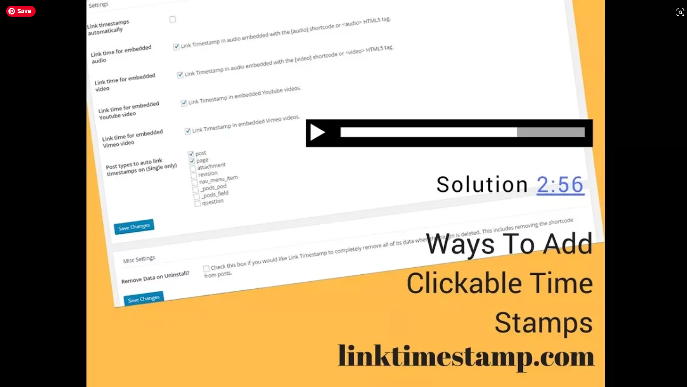
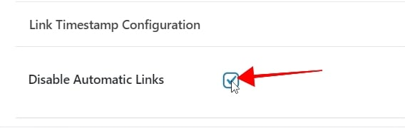
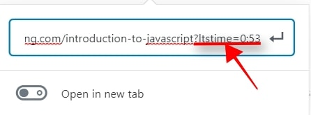
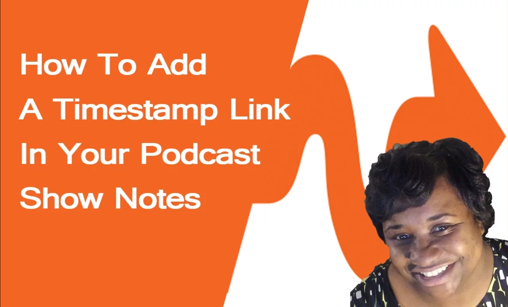

# Link Timestamp 

## Overview
Add a link to timestamps on your website. When the link is clicked the audio or video will jump to the correct time in the media player.

### Automatically link timestamps
* Link Timestamp can be configured to automatically link timestamps.
* Control which post type gets automatically linked from the settings page. (Settings > Link Timestamp)
* Control if timestamps are linked to audio or video. (Settings > Link Timestamp) This comes in handy if you have audio and video on the same page.
* Turn off auto linking on individual pages from the post editor.

### Manually link timestamps
* You can manually add links to your timestamps using the Link Timestamp button in the visual editor

### Link Timestamp will work with the following:
*   Vimeo videos
*   Youtube videos
* 	Smart Podcast Track Player
*   Soundcloud Embeded Player
*   Blubrry PowerPress Players
*	Libsyn Embedded Player
* 	Spreaker Embedded Player with JS API
*	Seriously Simple Podcasting Player
*   HTML5 <audio> elements
*   HTML5 <video> elements

### Control Autolinking
*	Auto link on single posts that are a specific post type
*	Auto link on single posts that belong to a specific category

### Link to a timestamp from a different page

{: style="float: left; margin:5px"}

Add `?ltstime=time` to the end of the link. THis is place holder text here. Auto link on single posts that are a specific post type Auto link on single posts that are a specific post typeAuto link on single posts that are a specific post type

 

### Media

| Syntax      | Description | Test Text     |
|    :----:   |    :----:   |     :----:    |
| <a href="https://www.youtube.com/watch?v=xPK_YNReXSE&t=1s" class="thumbnail" target="_blank"><a>    |        |  {: .thumbnail target="_blank"  }  |

